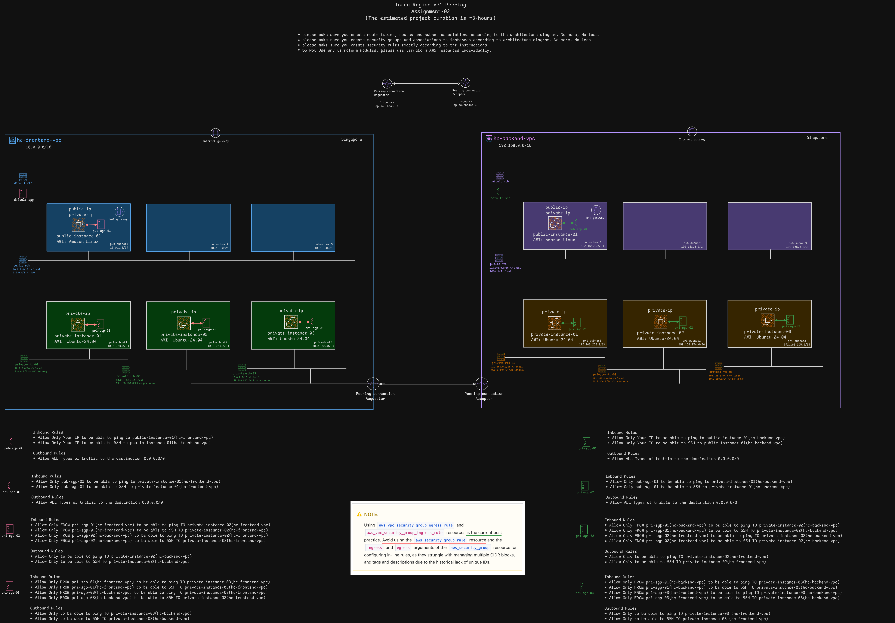

# 🚀 AWS VPC Peering Deployment (Local Terraform)

This project provisions **two VPCs (frontend & backend) in AWS** with **VPC peering**, subnets, route tables, internet gateways, EC2 instances, and security groups according to the following architecture:



---

## 📌 Project Objectives
- Create **frontend VPC** (10.0.0.0/16) and **backend VPC** (192.168.0.0/16).
- Attach **public & private subnets** in each VPC.
- Deploy **EC2 instances** in public/private subnets (Amazon Linux for public, Ubuntu 20.04 for private).
- Configure **security groups** for restricted connectivity:
  - Allow only ICMP + SSH between specified instances across VPCs.
  - Enforce east-west traffic rules exactly as per the diagram.
- Establish **VPC peering** between frontend ↔ backend.
- Configure **route tables** to ensure connectivity across VPCs.

---

## 📦 Project Structure
```bash
.
├── backend_instances.tf            # EC2 instances for backend VPC
├── backend_sgs.tf                  # Security groups for backend VPC
├── backend_vpc.tf                  # Backend VPC, subnets, IGW, NAT Gateway, route tables
├── data.tf                         # Data sources (AMI lookup, etc.)
├── frontend_instances.tf           # EC2 instances for frontend VPC
├── frontend_sgs.tf                 # Security groups for frontend VPC
├── frontend_vpc.tf                 # Frontend VPC, subnets, IGW, NAT Gateway, route tables
├── keypair.tf                      # SSH key pair for instances (for both frontend & backend)
├── outputs.tf                      # Outputs (instance IPs, VPC IDs, etc.)
├── terraform.tfvars                # Variable values (customize per environment)
├── variables.tf                    # Input variables
├── versions.tf                     # Terraform + provider versions
├── vpc-peering-assignment-02.png   # Architecture diagram
└── vpc_peering.tf                  # VPC peering resources

```

## ⚙️ Deployment Workflow
1. Navigate into project directory 
```bash
cd ace-aws-vpc-peering-cop2
```
2. Initialize Terraform
```bash 
terraform init
```
3. Validate configuration
```bash
terraform validate
```
4. Preview changes
```bash 
terraform plan
```
5. Apply infrastructure
```bash
terraform apply --auto-approve
```

## 📡 Verification
1. Get public IP of frontend and backend public intances:
```bash
terraform output
```
2. SSH into frontend public instance:
  - output private key
```bash
  terraform output -raw frontend_private_key > frontend-private-key01.pem 
  chmod 400 frontend-private-key01.pem
  terraform output -raw backend_private_key > backend-private-key01.pem
  cumod 400 backend-private-key01.pem
```
  - Access to Public EC2 instance
```bash
  ssh -i <forntend_private_key.pem> ubuntu@<frontend_public_ip>
```
3. Test connectivity
    - IMCP test frontend to backend 
    - Validate security group restrictions (only ICMP+SSH allowed as per diagram)

## 🔄 Teardown
To destroy all resources:
```bash
terraform destroy --auto-approve
```

## 📝 Notes
- All security groups are defined with least privilege rules per diagram.
- ```aws_security_group_rule``` resources are used for granular rule management.
- Tags are consistently applied using ```var.common_tags```.